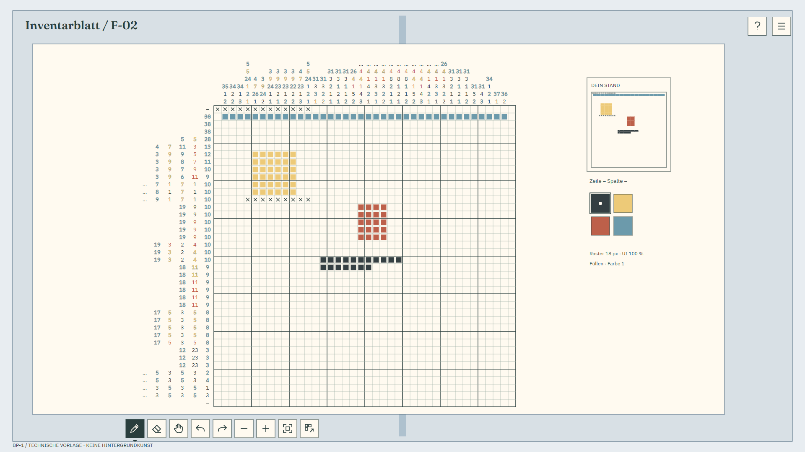

# BP-1 · Produktionsvorlage für den Inventarband

Stand: 26.09.2026 · Lieferung P-01 bis P-04 zu [#27](https://github.com/venomenon328/picross/issues/27)
unter [#21](https://github.com/venomenon328/picross/issues/21).
**Technische Arbeitskomposition und Bildbriefing, keine Hintergrundillustration.**

[Review-ZIP](bp1-review.zip) · [Bildbriefing](BRIEFING.md) · [Layoutdaten](layout.json) ·
[Prüfmanifest](manifest.json) · [Renderprüfung](render-checks.json) · [Prüfbericht](VERIFICATION.md).
Der eigene Draft-PR bindet Lieferung, ZIP-Hash, Head, Basis, CI und getrennten Selbstreview.
Auf GitHub sind die PNGs direkt einsehbar; das ZIP über „Download raw file“ laden.

## Eine Arbeitskomposition

Ein großer eingelegter Bogen liegt frontal über beiden Buchseiten und verdeckt den
Falz im gesamten Arbeitsbereich. Raster und Hinweise bleiben eine durchgehende Ebene.
Die Bindung ist oberhalb und unterhalb des Bogens sichtbar; Seitenschnitt, Deckel
und Tisch rahmen ihn ein. Der Bogen ist Teil der späteren gemalten Bühne. Die
UI-Überlagerung enthält **keine große opake Papierkarte** über der Illustration.
Die cremefarbene Fläche in den Layout-PNGs bezeichnet lediglich diese Papierzone.
Die blaugrauen Konturen bezeichnen Buch und Falz; sie sind keine Stil-/Materialprobe.

Die Inventarkarte mit eigener Miniatur steht rechts. Darunter liegen separate
Koordinaten, eine 2×2-Gruppe echter Farbmuster und aktives Werkzeug/Farbe. Neun
häufige Aktionen bilden eine kurze gemeinsame Leiste unten; Hilfe und Menü liegen
oben rechts. Das hält die 57×28-Arbeitsfläche frei. Bei F-03 sitzt die Inventarkarte
am rechten Buchrand und darf dort überstehen; ihr Inhalt bleibt vollständig sichtbar.
Das Rahmenrechteck ist eine technische Montierungsreserve, kein zusätzliches Werkzeug.

Fraunces + IBM Plex Sans (S1/P1) und die bestehenden Iconpfade sind reversible
Ausgangspunkte aus #26. Hier gibt es genau eine Anordnung, keine neue Stilserie.
Die größere leere Papierfläche bei F-01 ist bewusst: 24-px-Zellen werden nicht auf
1440p aufgeblasen. Spätere Malerei darf diese Ruhefläche nicht mit Dekoration füllen.
Es handelt sich um ein flaches ausgeklapptes Arbeitsblatt, nicht um ein halbes Buchblatt.

## Fünf native Größenproben

Alle Angaben sind Bildpixel, keine gemessene Windows-DPI. Herkunft der bisherigen
Flächen: [PR-#28-Unterlage am Referenzhead](https://github.com/venomenon328/picross/blob/9834ee834f5b83bbc5e6b17429a8fe7185c26758/docs/design/z1_1/README.md).

| PNG / editierbares SVG | UI / Zelle | Raster und sichtbare Spalten / Zeilen | Vergleich |
| --- | --- | --- | --- |
| [F-02 1920×1080](png/f02-1920-layout.png) / [SVG](svg/f02-1920-layout.svg) | 100 % / 18 px | 720×720; 1–40 / 1–40 | Bisheriger Demozoom und U1-Rasterursprung 510/252 bleiben. |
| [F-02 2560×1440](png/f02-2560-layout.png) / [SVG](svg/f02-2560-layout.svg) | 100 % / 18 px | 720×720; 1–40 / 1–40 | +320/+180 verschoben; identische Zellen, Zahlen, Icons und Miniaturgröße. |
| [F-01 2560×1440](png/f01-2560-layout.png) / [SVG](svg/f01-2560-layout.svg) | 100 % / 24 px | 480×480; 1–20 / 1–20 | Wie Referenz 20×20; neue Buchposition, kein Größenverlust. |
| [F-03 1920×1080](png/f03-1920-layout.png) / [SVG](svg/f03-1920-layout.svg) | 100 % / 24 px | 1368×672; 26–82 / 36–63 | Unverändert 57×28 = 1.596 Zellen. UI-Testdatensatz, Rätselqualität nicht abgenommen. |
| [F-02 1280×720](png/f02-1280-layout.png) / [SVG](svg/f02-1280-layout.svg) | 125 % / 22 px | 638×374; 1–29 / 1–17 | Unverändert 29×17 = 493 Zellen, 55-px-Aktionsziele. |

Hinweisflächen links/oben: F-02 groß 210×720 / 720×126, F-01 192×480 / 480×144,
F-03 240×672 / 1368×144, F-02 klein 210×374 / 638×120.
Gemeinsame Slots: 30×18 px bei UI 100 %, 37,5×22,5 px bei 125 %.
Hinweisschrift: 13 px bei 18-/22-px-Zellen, 14 px bei 24-px-Zellen;
bei UI 125 % daraus 16,25 px. Die 14 statt bisherigen 15 px halten den tatsächlichen
Fontbereich innerhalb des 18-px-Spaltenslots. Keine Zahl wird gestapelt oder geteilt.
Lange Folgen zeigen das rasterseitige Ende mit eigenem Präfixmarker; sämtliche
Originalfolgen stehen vollständig in den öffentlichen Daten. Die Vorlage baut keine
Hinweisnavigation, Hoverauflösung, H1-, Eingabe- oder Solverengine.

## Dateien und Ebenen

Für jeden Tabellenfall gibt es vier gleich große PNG-/SVG-Paare mit demselben Präfix:

| Endung | Bedeutung / Verwendung |
| --- | --- |
| `-layout` | Editierbare Arbeitskomposition; technische Buch-/Papierkonturen plus UI, ausdrücklich ohne fertige Kunst. |
| `-ui` | RGBA-Überlagerung mit transparentem Außenraum und transparentem Rasterpapier. Nur Miniaturkarte/kleine Aktionsgehäuse sind opak. Keine Fontdateien eingebettet. |
| `-keepout` | Binäre Freihaltemaske: **weiß = ruhiger Untergrund**, ohne Fasern, Flecken, Zeichnungen oder Schatten; **schwarz = Detailgestaltung möglich**, weiterhin innerhalb der Art Direction. Kein Alpha/Inpainting-Auftrag. |
| `-crop` | Binäre Beschnittmaske: **weiß = erhalten**, **schwarz = äußerster optionaler Beschnitt**. Nicht mit der Freihaltemaske verwechseln. |

[Master-Freihaltung](png/master-keepout.png) / [SVG](svg/master-keepout.svg) ist die
Vereinigung aller fünf invers auf 2560×1440 transformierten Ruheflächen.
[Master-Beschnitt](png/master-crop.png) / [SVG](svg/master-crop.svg) hält alles bis auf
8 px äußeren Dekorationsrand geschützt. Beide sind produktionsfertige technische
Masken, keine Illustrationen. Die Einzelmasken dienen der späteren Größenkontrolle.
Freihalterechtecke werden nach außen auf ganze Maskenpixel gerundet, damit keine
grauen Antialias-Kanten oder ungeschützten Teilpixel entstehen.

`layout.json` enthält `rects` als `[x,y,Breite,Höhe]`, Ursprung oben links,
und `normalized` als `[x/W,y/H,Breite/W,Höhe/H]`. Rechteckenden sind exklusiv.
Raster, beide Hinweisflächen, Miniatur/Karte, Palette, Koordinaten, Status,
Aktionsgruppen, Buch, Falz und Arbeitsblatt sind getrennt bezeichnet.
`actions` enthält einzelne Trefferflächen; `decorative_edges` die Beschnittstreifen.
Der Falz ist eine **verdeckte** Gesamtzone; sichtbar ist nur ihr Anteil außerhalb
`sheet`. Er darf im eingelegten Bogen weder gemalt noch beschattet werden.
`origin_zero_based` beschreibt den Ausschnitt, nicht zusätzliche Startfelder.

Der Ebenenvertrag für BP-2/BP-3 lautet:

1. Ein opakes gemaltes Hintergrundbild: Tisch, Buch, Bindung, Seitenschnitt,
   ruhiger eingelegter Bogen. BP-1 liefert dafür Geometrie und Briefing, kein Bild.
2. Keine separate gemalte Montierungsebene geliefert oder erforderlich. Kleine
   Karten-/Werkzeugrahmen sind derzeit Bestandteil der präzisen UI-Vorlage.
3. Unabhängig gerenderte Hinweise, Zellen/X, Miniatur, Palette, Icons und Texte.
   Die SVG-Gruppe `study-labels` enthält technische Bildkennzeichnungen; in späteren
   Produktkompositionen die Kennzeichnung außerhalb der eigentlichen UI führen.
   F-03s Testdatensatzhinweis muss weiterhin sichtbar bleiben.

## Hintergrundanpassung ohne Zoomkopplung

Beide BP-2-Bilder werden auf derselben 2560×1440-Geometrie hergestellt. Für 1440p:
Faktor 1, voller Ausschnitt `[0,0,2560,1440]`; für 1080p: Faktor 0,75, voller
Ausschnitt; für 720p: Faktor 0,5, voller Ausschnitt. Die Seitenverhältnisse sind
identisch, daher braucht keiner der fünf Fälle einen Beschnitt. Die Bindung bleibt
proportional. **Nur das Hintergrundbild** wird so eingepasst; jede UI wird aus
ihrem eigenen Pixelvertrag gerendert. Keine Skalierung eines kompletten Screens,
kein 9-Slice des Buchs und keine implizite Kopplung der 22-px-Probe an UI 125 %.

Optional dürfen höchstens die schwarzen 8 Masterpixel außen entfallen (6 px bei
1080p, 4 px bei 720p), ohne anschließendes Auffüllen durch Strecken. Die UI verbleibt
an ihren Pixelpositionen. Technische Fußzeilen zählen nicht als Bildmotiv; ein
andersartiges Fensterformat ist hier nicht untersucht und benötigt eine eigene
Anpassungsprüfung. Kein universeller responsiver Produktvertrag wird behauptet.

## Daten, Herkunft und Anschlusssemantik

[F-01](sources/f01-public-demo.json), [F-02](sources/f02-public-demo.json),
[F-03](sources/f03-public-demo.json) sind bytegleiche öffentliche Exporte aus
PR #28 am Head `9834ee834f5b83bbc5e6b17429a8fe7185c26758`. Sie enthalten Original-
Hinweise/Palette plus explizite `z1-demo-1`-Zellen aus
[demo.gd am PR-#25-Head](https://github.com/venomenon328/picross/blob/df7ac589e900a6d6d7c5080599c6a5ace47c395d/prototypes/p1/design/demo.gd).
Der abschließende Undo bleibt unbekannt. Es gibt keine neue Lösung, Startbelegung
oder Savequelle. Raster und Miniatur lesen dieselbe Liste einschließlich Fehlern.
Original-Fixtures, Proofs und Ergebnisbilder bleiben unverändert.

[Iconpfade und deutsche Tooltips](sources/icons.json) sind unverändert aus dem
[PR-#28-Generator](https://github.com/venomenon328/picross/blob/9834ee834f5b83bbc5e6b17429a8fe7185c26758/tools/design_study/generate.py)
übernommen; keine Übernahme des ganzen Studienpakets. Aktives Werkzeug erhält
eine Dreieckmarke, aktive Farbe Außenrahmen und hellen Punkt. Farbauswahl aktiviert
Füllen auch nach Hand/Radierer; PR #25/R1/B-01 wird nicht zum Sollverhalten.
G1, H1, Undo/Redo und Speicher-/Recoveryverträge bleiben bestehen. Seltene Optionen
werden im späteren Menü ausgeschrieben: UI 100/125 %, „Hinweise rasterseitig
ausrichten“, „Erfüllte Hinweise markieren“, „Zum Album“, „Beenden“. Hilfe auf Abruf;
reale Speicherfehler bleiben sichtbar/blockierend. Diese Bilder implementieren
keine dieser Aktionen und behaupten keinen Speichererfolg.

C1 bleibt der separate Vorschlag aus #26: Originalfarbe der Hinweise 2/4 plus
0,55-px-Tintenkontur. Keine Umfärbung der Rätselpalette und keine zugesicherte
Barrierefreiheit. Das durchgestrichene F-02-`38` stammt ausschließlich aus dem
bereits dokumentierten eigenen Zeile-2-Block; keine dekorativen H1-Markierungen.

Schriftquellen: [gepinntes Fontmanifest](sources/fonts.json), auf Fraunces und
IBM Plex Sans begrenzt; OFL-Wortlaut am Referenzstand:
[Fraunces](https://github.com/venomenon328/picross/blob/9834ee834f5b83bbc5e6b17429a8fe7185c26758/docs/design/z1_1/fonts/Fraunces-OFL.txt),
[IBM Plex Sans](https://github.com/venomenon328/picross/blob/9834ee834f5b83bbc5e6b17429a8fe7185c26758/docs/design/z1_1/fonts/PlexSans-OFL.txt).
Fonts werden nur temporär zum Rendern geladen und hashgeprüft, nicht installiert,
eingebettet oder mit dem ZIP verteilt. PNGs sind die verbindlichen Rendernachweise.
SVG-Text bleibt editierbar; ohne diese Fonts kann ein Editor Ersatzschriften zeigen.

## Offene Bildinputs und Übergabe

Für BP-2 gemeinsam übergeben: dieses ZIP, `master-keepout`, `master-crop`,
`f02-2560-layout` für Geometrie, `f02-1920-layout` für die primäre Größe sowie das
[Briefing](BRIEFING.md). Die erneut gezeigte erste Albumstudie ist **keine erreichbare
Repositorydatei** und wurde hier nicht angesehen. Im beauftragten Bildlauf ihre
tatsächliche Verfügbarkeit prüfen und gegebenenfalls erneut bereitstellen lassen.
Die textliche Beschreibung aus #27 reicht für BP-1 aus.

BP-2 braucht einen neuen ausdrücklichen Bildproduktionsauftrag; BP-3 braucht danach
zwei tatsächlich zugängliche Bilddateien mit Maßen, SHA-256, Quelle/Werkzeug,
Bearbeitung und Nutzungsstatus. Finale Layout-/Schrift-/Kontrast-/Assetwahl durch
den Eigentümer erst an der integrierten Komposition. Keine BP-2/BP-3-Arbeit,
kein Beginn von #23/#24, kein Abschluss von #27/#21 und kein Merge/Release durch BP-1.
