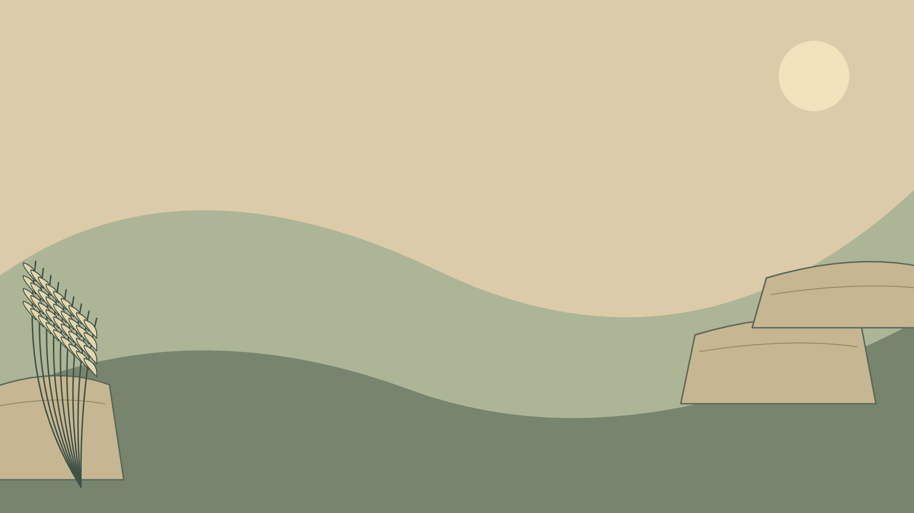

# Z1.1 · Drei Hintergrundbriefings

Stand: 26.09.2026 · S-05 aus Issue #26. **Vorläufige eigene Kompositionsskizzen**,
keine finalen Hintergrundassets. Alle Bilder sind 1920×1080 / 16:9 und enthalten
weder UI noch Zahlen, Texte oder konkrete Rätselmotivszenen. Ihre Umgebung ist
unabhängig vom unbekannten Motiv des jeweiligen Blatts. Es wurde kein externer
Bildgenerator verwendet; diese Briefings beauftragen noch keine #27-Produktion.

## S1 · Naturstudien am warmen Hang

[Editierbare Vektorvorlage](svg/s1-background.svg).

**Direkt nutzbares Positivbriefing:** Illustriere eine warme, ruhige offene Landschaft
als Umgebung eines Naturstudienalbums. Breit geschichtete, flache Steinplatten
am rechten unteren Rand, eine kleine gezeichnete Gruppe von Samenständen am linken
Rand. Das Licht ist weich und spätnachmittäglich, mit einer flachen hellen Scheibe
oben rechts. Große matte Sand-, Salbei- und Olivflächen mit klaren dunkelgrünen
Konturen, keine Fototexturen. Ruhe und neugierige Beobachtung statt Gartenromantik.
Das Zentrum muss auch ohne aufgelegtes UI bewusst ruhig komponiert sein.

**Arbeits-/Beschnittvorgaben:** 16:9; ruhige Zone x=10–67 %, y=8–92 %.
Außenillustration besonders x=0–12 % und x=72–100 %. Oben rechts wenig Mikrodetail,
damit die Miniatur davor frei stehen kann. Links/rechts jeweils bis 8 %, oben/unten
bis 5 % dürfen ohne Informationsverlust beschnitten werden. Samenstände nicht exakt
an eine spätere Rasterkante anpassen; Größenprobe mit dichtem F-03 berücksichtigen.

**Negativbriefing:** Keine Pflanzen-Motivlösung, kein Motivname, kein Tier als
Hilfsfigur, keine Albumseiten, Texte, Stempel, Raster oder UI im Hintergrund.
Kein beliebiges umlaufendes Blätterornament, keine fotografischen Steintexturen,
keine harte Vignette oder hohe Kontraste in der Ruhezone. Natur bleibt Beispielstimmung,
keine Einschränkung des Rätselkatalogs.

## S2 · Stille Ufer und Ferne

[Editierbare Vektorvorlage](svg/s2-background.svg).

**Direkt nutzbares Positivbriefing:** Eine flächig gezeichnete ruhige Uferlandschaft
mit drei bis vier Tiefenebenen. Blasses warmes Gegenlicht rechts oben, ferne
graugrüne Hügel, größere petrolfarbene Wasser-/Uferflächen unten, ein heller
Vordergrundvorsprung rechts unten. Klare geschlossene Konturen und wenige lange
Wasserlinien. Neugier auf eine Umgebung vermitteln, ohne ein Reiseziel zu benennen.
Der Vordergrund darf dunkel sein, die Mitte bleibt gleichmäßig und detailarm.

**Arbeits-/Beschnittvorgaben:** 16:9; Ruhezone x=9–67 %, y=10–92 %. Die räumliche
Wirkung muss rechts außerhalb dieser Zone sichtbar bleiben. Miniaturplätze oben
rechts und unten rechts sind beide zu berücksichtigen, keine zentrale Sehenswürdigkeit
an einem dieser Plätze. Außen jeweils 8 %, vertikal 5 % beschneidbar; Horizont nicht
exakt auf Höhe des Rasterrands führen.

**Negativbriefing:** Keine Karte, Route, Ortsnamen, Flaggen, Tickets, Stempelmechanik,
Figur, Timer oder Lösungsvorschau. Keine identifizierbare Region voraussetzen.
Kein Leuchtturm oder anderes konkretes Fixturemotiv, keine eingebrannten Journal-
Rahmen, Zahlen oder Symbole. Kein photorealistischer Nebel, keine spiegelnden
Lichteffekte, keine kleinteiligen Kontrastkanten hinter Hinweisen.

## S3 · Licht auf Papier und Druckfarbe

[Editierbare Vektorvorlage](svg/s3-background.svg).

**Direkt nutzbares Positivbriefing:** Eine reduzierte grafische Atelierumgebung.
Große ocker- und terrakottafarbene Flächen mit breitem schrägem Lichteinfall von
links oben. Ein einzelner dunkler Farbroller am linken unteren Rand und ein
einfach gefalteter heller Papierbogen rechts unten, beide klar konturiert und
flächig illustriert. Das Zentrum bleibt eine ruhige helle Fläche. Material durch
Kanten und minimale Linien vermitteln, nicht durch eine Schreibtischfotografie.

**Arbeits-/Beschnittvorgaben:** 16:9; Ruhezone x=10–67 %, y=9–92 %.
Diagonalen nur außerhalb der Arbeitszone dominant; sachliches Raster bleibt später
frontal und unverzerrt. Rechter Farbblock trägt die Atmosphäre auch bei F-03.
Roller/Papier dürfen an Außenkanten teilweise angeschnitten werden; jeweils 8 %
horizontal und 5 % vertikal als sichere Beschnittreserve. Keine wichtigen Inhalte
in Miniatur-/Werkzeugzonen platzieren.

**Negativbriefing:** Keine Werkbanksimulation, Werkzeugökonomie, neue Interaktionen,
Objektsammlung oder verpflichtende Perspektive. Keine Drucke mit vorweggenommenen
Rätsellösungen, kein Text, keine Passmarken des UI im Hintergrundbild selbst.
Kein schmutziger Rasteruntergrund, keine starken Körnungen oder zufälligen Flecken
unter Zahlen. Keine fremden Marken oder identifizierbaren Produktgeräte.

## Produktionsgrenze

Die spätere #27-Arbeit darf diese Briefings erst nach Eigentümerwahl konkretisieren.
Gewünschte Stil-/UI-Änderungen zuvor übernehmen. Für jeden Kandidaten dann den
ausgewählten Spielscreen darüberlegen und die freien Randzonen vergleichen.
Diese Unterlage bestätigt weder die Verfügbarkeit eines bestimmten Bilddiensts
noch einen Auftrag für finale Bildproduktion.
