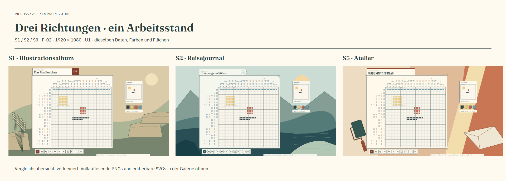
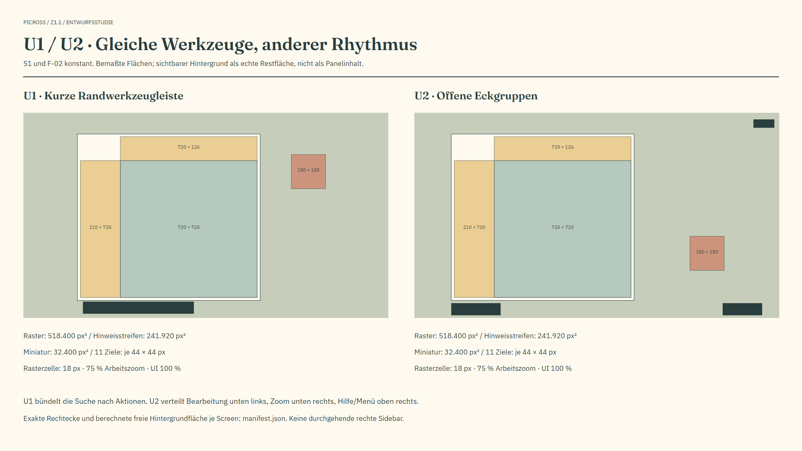
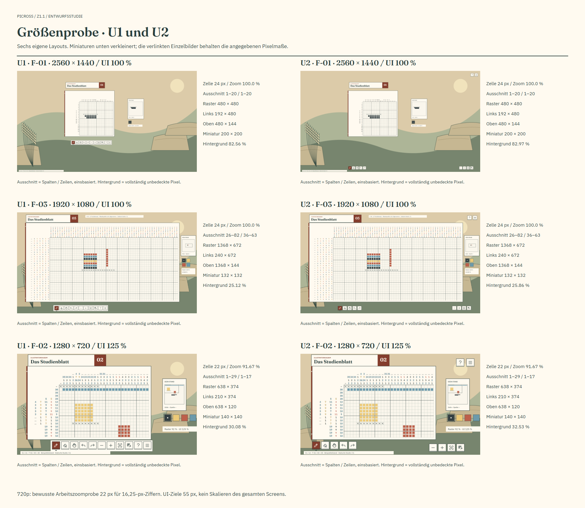

# Z1.1 · Ein Blatt, drei eigene Stimmen

Stand: 26.09.2026 · [Issue #26](https://github.com/venomenon328/picross/issues/26)
unter [#21](https://github.com/venomenon328/picross/issues/21).
**Statische Entscheidungsvorlage; keine Stilwahl oder Produktintegration.**

Die [lokale Galerie](index.html) zeigt sämtliche 21 Tafeln und verlinkt jeweils
PNG in Originalgröße und editierbares SVG. Nach Checkout ohne Server oder Netzwerk
öffnen. Auf GitHub direkt die Bilder unten beziehungsweise im Ordner `png/` öffnen;
GitHub rendert die HTML-Galerie nicht als Website.

## S-01 · Unterscheidbare Formensprachen

| Richtung | Eigene gestalterische Aussage | Unterschied zu V2 und verbleibender Nachteil |
| --- | --- | --- |
| [S1 · Illustrationsalbum](png/s1-u1-f02-1920.png) | Eingelegtes Studienblatt mit dunkler Bindekante, zweifarbiger Registerzunge, kräftigen Fraunces-Serifen und quadratischen Druckfeldern. Eine steinige Wiesenlandschaft mit gezeichneten Gräsern rahmt das Blatt. | Redaktionelle Hierarchie statt gleichrangiger Rundkarten; sichtbarer Außenraum statt leerer Papierwüste. Die breite Registerzunge ist auffällig und braucht bei dichten Rastern Disziplin. |
| [S2 · Reisejournal](png/s2-u1-f02-1920.png) | Leichter Journalwimpel, feine gestrichelte Naht, gefaltete Ecke, ruhigere Displaygewichtung und kreisförmige Instrumente. Gestaffelte Ufer-/Hügelformen öffnen einen atmosphärischen Raum. | Eigenständige Silhouette und runde Bedienelemente statt generischer Textbuttons; Landschaft mit Tiefe statt Blattornament. Der Kompass ist nur ein Rahmenmotiv, keine neue Funktion; die Reiseassoziation nimmt eine Themenentscheidung vorweg, wenn sie ungeprüft übernommen würde. |
| [S3 · Atelier](png/s3-u1-f02-1920.png) | Plakative Barlow-Überschrift, IBM-Plex-Mono-Zahlen, Druckstreifen, Passmarken und angeschnittene Werkzeug-/Farbflächen. Ein Roller und gefalteter Bogen bilden eine reduzierte Werkstattumgebung. | Typografisch am weitesten von V2 entfernt; klare Druckgrafik statt weicher Karten. Monospaced-Zahlen benötigen mehr Breite; die diagonale Außenkomposition wirkt energischer und weniger meditativ. |

Die Hauptstudien nutzen **dieselbe U1-Geometrie, denselben F-02-Teilstand und dieselbe
Originalpalette**. Es gibt keine unterschiedlichen Rätsel als Stimmungstrick.
[S1-Detail](png/s1-detail.png), [S2-Detail](png/s2-detail.png) und
[S3-Detail](png/s3-detail.png) zeigen Ausschnitte der tatsächlichen Screens ohne
Hintergrund. Titel, Rahmen, Chips und Icongehäuse bleiben unterscheidbar. Die
Vorlagen enthalten benannte Gruppen für Hintergrund, Titel, Arbeitsebene,
Raster, Hinweise, Miniatur und Palette. Texte bleiben Text, Icons bleiben Pfade.

V2 wurde am benannten PR-Head gelesen und sein vorhandenes 1920er Renderbild
visuell verglichen. Dort dominieren zwei große cremefarbene Rundflächen, Open Sans,
Textbuttons und Randblattwerk. Hier schrumpft das Blatt auf den Arbeitsverbund;
Miniatur und Palette stehen selbstständig, häufige Aktionen bilden eine niedrige
Leiste. Diese Änderung betrifft Komposition, Typografie und Form, nicht nur Farben.
Die einfache eigene Illustration ist ein vorläufiger Kompositionsnachweis,
kein fertiges Hintergrundasset oder vorgezogene Lieferung von #27.

## S-02 · Zwei begrenzte Anordnungen

[U1](png/s1-u1-f02-1920.png) bündelt elf häufige Aktionen in einer kurzen unteren
Leiste; die Miniatur liegt separat oben rechts. [U2](png/s1-u2-f02-1920.png)
verteilt Bearbeitung links unten, Navigation rechts unten und Hilfe/Menü rechts
oben. Die Miniatur rückt nach rechts unten. Es gibt in keiner Variante eine
durchgehende rechte Seitenkarte. S1 dient nur als kontrollierte Vergleichsrichtung.

| Hauptvergleich, 1920×1080 | U1 | U2 |
| --- | --- | --- |
| Raster | 720×720, Ursprung 510/252 | 720×720, Ursprung 420/252 |
| Linke / obere Hinweise | 210×720 / 720×126 | Gleich |
| Gemeinsame Slots | 30 px horizontal / 18 px vertikal | Gleich |
| Miniatur, eigene Zellen | 180×180, Ursprung 1410/220 | 180×180, Ursprung 1450/650 |
| Häufige Aktionen | 11 Ziele zu 44×44; 52 px Abstand | 5 + 4 + 2 Ziele, je 44×44 |
| Vollständig freier Hintergrund, S1 | 1.051.417 px / 50,70 % | 1.066.779 px / 51,45 % |

Die Hintergrundmessung blendet ausschließlich die Illustration aus und zählt
vollständig transparente Pixel im restlichen Rendering. Papier, Texte, Linien,
Icons und Studienkennzeichnung zählen als bedeckt, einschließlich Antialiasing.
Das ist tatsächliche unbedeckte Fläche, keine Behauptung über deren ästhetische Güte.
Aktuelle Werte und genaue Geometrie stehen im [Manifest](manifest.json).

## S-03 · Icons, Schrift und Darstellungszustände

[Iconblatt](png/icons.png): zwölf selbst gezeichnete Vektorsymbole, einschließlich
Album-Anschlussstelle; Normal/Hover/Aktiv/Deaktiviert bei tatsächlichen 44-Pixel-
Zielen und 26-Pixel-Zeichnungsflächen. Die SVG-Titel enthalten die vorgesehenen
deutschen Tooltips. Zustände auf Einmalaktionen sind Muster für Hover/Drücken,
keine neuen rastenden Spielschalter. Werkzeugaktivität erhält zusätzlich eine
Dreieckmarke. Die aktive Originalfarbe erhält einen Außenrahmen und hellen Punkt.

[Typografietafel](png/typography.png): **P1** kombiniert Fraunces mit IBM Plex Sans,
**P2** Barlow Condensed mit IBM Plex Mono. Sie zeigt 1/7, 3/8, mehrstellige Zahlen,
Umlaute und lange Folgen in 13/16,25/18 px sowie charaktervolle Titel in 40 px.
Schriftfamilien, unveränderte Originaldateien und vollständige OFL-Texte sind mit
gepinnten Quellen enthalten. Keine Systemfontkopien oder bloßen Lizenzvermutungen.

Die Hauptscreens erproben **C1**: Originalfüllfarbe der hellen Hinweisziffern
(Farb-IDs 2/4) mit 0,55 px dunkler Kontur. Die Tafel vergleicht C0 ohne Kontur mit
C1. Das ist keine Umdefinition der Rätselpalette und keine beschlossene
Accessibility-Lösung. UI-Tinte auf opakem Papier und helle Aktivicons auf Akzent
erreichen im Prüfer jeweils mindestens 4,5:1. Helle Originalhinweise bleiben
gesondert zu bewerten; C1 verbessert ihre Kontur, garantiert aber keine vollständige
Barrierefreiheit. Die deaktivierten Icons sind zusätzlich diagonal gekennzeichnet.

Das H1-Beispiel ist konkret: F-02, Zeile 2, ein Hinweis `38` in Farbe 4, eigene
Füllungen in Spalte 2–39, übrige Zellen unbekannt. Nur diese vollständige Linie
begründet die Durchstreichung; keine versteckte Lösung oder neue H1-Analyse.
Andere Zahlen werden nicht dekorativ abgehakt. Der spätere Produktpfad muss H1
weiterhin vollständig aus den eigenen Linienzuständen ableiten.

Verbindliche Anschlusssemantik, keine Implementierung durch diese Studie:

| Aktion / Zustand | Vertrag für eine spätere Integration |
| --- | --- |
| Farbauswahl | Aktiviert **Füllen**, auch nach Hand/Radierer. R1/B-01 aus PR #25 ist ausdrücklich kein Designstandard. |
| Füllen / Radierer / Hand | Bestehende linke/rechte Gesten, G1-Achsenneuwahl und elastische Vorschau unverändert. Kein zusätzliches X-/O-Werkzeug. |
| Undo / Redo | Ein Strich bleibt atomar. Kein neuer Bewertungs-/Fehlerindikator. |
| Hilfe | Erklärt die Mausaktionen auf Abruf; keine permanente mehrzeilige Anleitung. |
| Menü | Seltene Optionen ausgeschrieben: UI 100/125 %, „Hinweise rasterseitig ausrichten“, „Erfüllte Hinweise markieren“, „Zum Album“, „Beenden“. Bestehender bestätigter Blattreset bleibt beim Albumablauf. |
| Speicher-/Recoveryfehler | Bei Auftreten sichtbar und blockierend gemäß bestehendem Vertrag; niemals als Hilfetext verstecken. Die Studie behauptet keinen Speichererfolg. |
| Album | Nur Anschlussstelle, kein neuer Album- oder Progressionsablauf. |

## S-04 · Daten- und Größenproben

Die Quellen enthalten eine kleine explizite Übertragung der Demo-Eingaben aus
`z1-demo-1` am PR-Head `df7ac589e900a6d6d7c5080599c6a5ace47c395d`.
Der abschließende zurückgenommene Strich bleibt im Bild unbekannt. Beispiele dürfen
Fehler enthalten; sie werden nicht korrigiert. Raster und Miniatur sind aus derselben
Zellliste gezeichnet; eine abgeschnittene Rasteransicht verändert die Miniatur nicht.
Es werden nur öffentliche Hinweis-/Palettendaten und eigene Zellen exportiert,
keine Lösung, kein Reveal, kein Motivname. Die vollständigen Original-Fixtures
und Proofs bleiben unangetastet.

| Fall, jeweils U1/U2 | Raster / Ausschnitt (Spalten; Zeilen, einsbasiert) | Abweichung gegenüber Hauptvergleich |
| --- | --- | --- |
| F-01, 2560×1440, UI 100 % | 480×480; 1–20; 1–20; 24 px/Zelle, 100 % | Keine aufgeblasenen Zellen; Hinweise 192×480 / 480×144, Miniatur 200×200. Viel ruhiger Außenraum. |
| F-03, 1920×1080, UI 100 % | 1368×672; 26–82; 36–63; 24 px/Zelle, 100 % | Verdichteter Rahmen; Hinweise 240×672 / 1368×144, Miniatur 132×132, Palette 2×2. Lange Originalfolgen in gemeinsamen Slots. |
| F-02, 1280×720, UI 125 % | 638×374; 1–29; 1–17; 22 px/Zelle, 91,67 % | Eigenes Layout, 55-px-Ziele, Hinweise 210×374 / 638×120, Miniatur 140×140. Bewusste Arbeitszoomprobe für größere Ziffern; nicht die Skalierung eines 1080er Screens. |

Die 720er Probe wurde zunächst mit 18-px-Zellen gerendert; mehrstellige Ziffern
bei UI 125 % standen zu eng. Die gezeigte 22-px-Probe ist eine explizite alternative
Arbeitszoomwahl innerhalb der bestehenden Zoomfolge, **keine Kopplung von UI- und
Rasterzoom als neue Produktregel**. Daraus folgt keine Änderung des P1-Startzooms.

Überlauf zeigt vollständige Tokens und einen reservierten Präfixmarker am
rasterseitigen statischen Leseende. Die exportierten Originalfolgen erhalten alle
Werte/Reihenfolgen. Diese Studie implementiert keine Hinweisnavigation, Solver- oder
Eingabelogik. Erreichbarkeit anderer Leseenden, Hoverauflösung, flüssiger Drag,
G1/H1/Undo und echte Bedienbarkeit müssen in #23 nativ nachgewiesen werden.

## S-05 · Vorläufige Umgebungen und Entscheidung

[Drei unmittelbar nutzbare Bildbriefings](BACKGROUNDS.md) begleiten die getrennten,
UI-freien SVG-/PNG-Kompositionen. Sie beschreiben Licht, große Formen, Ruhezone,
erlaubten Beschnitt und ausdrückliche Negativvorgaben. Es wurden keine fremden
Screenshots, KI-Rasterbilder oder kostenpflichtigen Dienste verwendet. Die eigenen
Vektorskizzen sind in diesem Paket vollständig bearbeitbar.

**Empfehlung, keine Wahl:** S1 + U1 + P1 zuerst zur Diskussion stellen. Das
Studienblatt verbindet Albumcharakter mit kurzer Aktionssuche und der ruhigen
Ziffernschrift. S2 ist die stärkere Alternative für räumliche Atmosphäre; S3 bietet
die markanteste typografische Identität. U2 gewinnt Offenheit, verteilt aber die
Suchorte stark, besonders auf 1440p. Ob diese Verteilung angenehm ist, bleibt eine
echte Bedienfrage. C1 nur nach Sichtung in Originalgröße entscheiden.

Der Eigentümer entscheidet anhand konkreter Dateinamen/Commit: Stil S1/S2/S3,
Anordnung U1/U2, Schriftpaarung P1/P2 und C0/C1 beziehungsweise konkrete Änderungen.
Diese Auswahl ist vor #27 und #23 nötig; die endgültige Album-/Reisethemenwahl wird
nicht aus der Empfehlung abgeleitet. Die Studie darf zuvor technisch reviewed
werden. Unabhängiges Review und Mergefreigabe bleiben separate Schritte.

Prüfmethoden, Quellen und Reproduktion: [SOURCES.md](SOURCES.md).
Der Draft-PR bindet finalen Head, CI und getrennten Selbstreview. Kein Merge,
Release, Windows-Produktneubau oder Beginn von #27/#23/#24. Der Branch und offene
R1/B-01-Befund von PR #25 bleiben unverändert.
